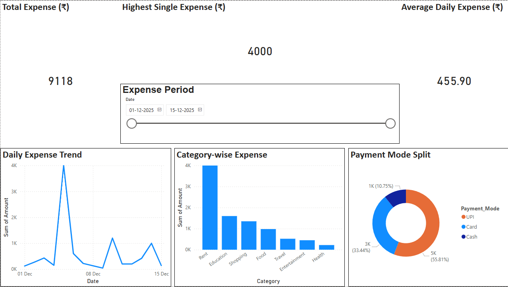

# Personal Finance Dashboard (Power BI)

## 📊 Project Overview
This project is an interactive Personal Finance Dashboard built using Power BI to analyze daily expenses and spending patterns from real-world data.

The dashboard helps identify major expense categories, spending trends, and preferred payment modes.

---

## 🛠️ Tools & Technologies
- Power BI
- Microsoft Excel

---

## 📈 Dashboard Features
- KPI cards for Total Expense, Average Daily Expense, and Highest Single Expense
- Category-wise expense analysis
- Daily expense trend visualization
- Payment mode distribution (Cash / UPI / Card)
- Interactive date range slicer

---

## 🔍 Key Insights
- Rent and Education contribute the largest share of total expenses
- Fixed-cost days show clear spending spikes
- UPI is the most frequently used payment mode

---

## 📷 Dashboard Preview

---

## 📂 Files in this Repository
- `dashboard_screenshot.png` – Snapshot of the Power BI dashboard
- `personal_finance_data.xlsx` – Sample dataset used for analysis
- `Personal_Finance_Dashboard.pbix` – Power BI project file (optional)

---

## 🚀 Future Enhancements
- Month-over-Month (MoM) analysis using DAX
- Budget alerts and forecasting
- Advanced tooltips and drill-through reports
